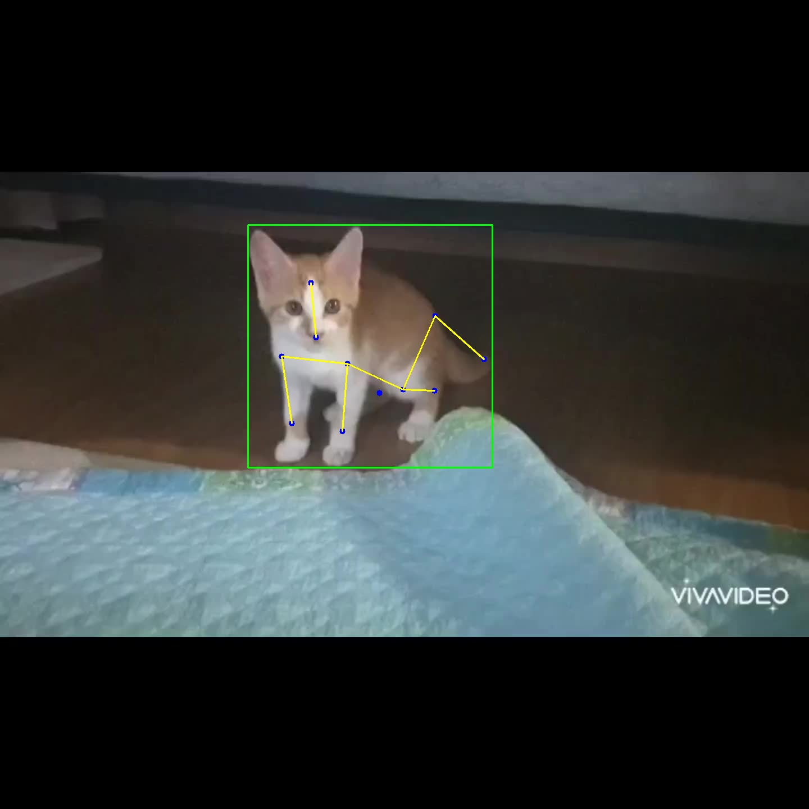
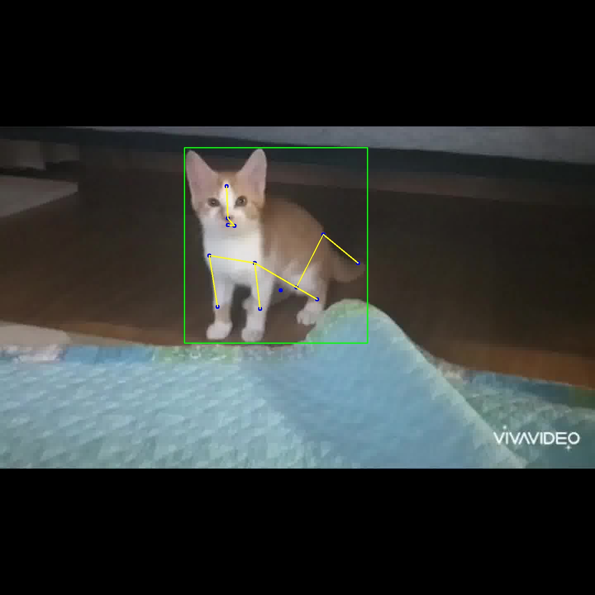

## YOLO Data - Skeleton 추가
<table>
  <tr>
    <td>
      
    </td>
    <td>
      
    </td>
    <td>
      
    </td>
  </tr>
</table>

#### Keypoints:
- 0: Nose
- 1: Forehead
- 2: Mouth Corner
- 3: Lower Lip
- 4: Neck
- 5: Front Right Leg Start
- 6: Front Left Leg Start
- 7: Front Right Ankle
- 8: Front Left Ankle
- 9: Right Thigh
- 10: Left Thigh
- 11: Rear Right Ankle
- 12: Rear Left Ankle
- 13: Tail Start
- 14: Tail End

#### Skeleton:
- [0, 1]: Nose to Forehead
- [0, 2]: Nose to Mouth Corner
- [2, 3]: Mouth Corner to Lower Lip
- [1, 4]: Forehead to Neck
- [4, 5]: Neck to Front Right Leg Start
- [4, 6]: Neck to Front Left Leg Start
- [5, 7]: Front Right Leg Start to Front Right Ankle
- [6, 8]: Front Left Leg Start to Front Left Ankle
- [9, 11]: Right Thigh to Rear Right Ankle
- [10, 12]: Left Thigh to Rear Left Ankle
- [4, 13]: Neck to Tail Start
- [13, 14]: Tail Start to Tail End
- [9, 13]: Right Thigh to Tail Start (Right Lower Body)
- [10, 13]: Left Thigh to Tail Start (Left Lower Body)
- [5, 9]: Front Right Leg Start to Right Thigh (Right Body)
- [6, 10]: Front Left Leg Start to Left Thigh (Left Body)
- [5, 6]: Front Right Leg Start to Front Left Leg Start (Chest Outline)
- [9, 10]: Right Thigh to Left Thigh (Hip Outline)
